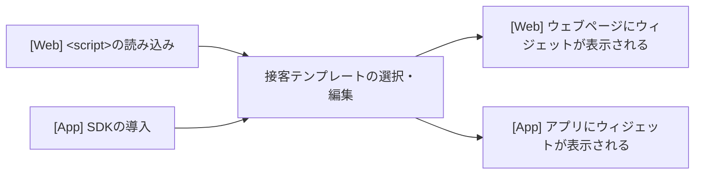

---
# You can also start simply with 'default'
# theme: seriph
# random image from a curated Unsplash collection by Anthony
# like them? see https://unsplash.com/collections/94734566/slidev
# background: https://cover.sli.dev
# some information about your slides (markdown enabled)
title: サードパーティウィジェットのアクセシビリティ
# info: |
#   ## Slidev Starter Template
#   Presentation slides for developers.

#   Learn more at [Sli.dev](https://sli.dev)
# apply unocss classes to the current slide
class: text-center
# https://sli.dev/features/drawing
drawings:
  persist: false
# slide transition: https://sli.dev/guide/animations.html#slide-transitions
transition: undefined
# enable MDC Syntax: https://sli.dev/features/mdc
mdc: true
# open graph
# seoMeta:
#  ogImage: https://cover.sli.dev
colorSchema: light
routerMode: hash
contextMenu: false
---

# サードパーティウィジェットの アクセシビリティ

各社の事例に学ぶ！　アクセシビリティを向上させる開発プロセス

<!--
- イベント: [各社の事例に学ぶ！アクセシビリティを向上させる開発プロセス - connpass](https://findy.connpass.com/event/358706/)
- 発表時間: 15分
- よろしくお願いします
-->

---
layout: intro
---

# yuhei

- 株式会社プレイド
- デザインエンジニア
- Developer Experienceチーム

🏠 [yuheiy.com](https://yuheiy.com/)

<!--
- 最初に簡単に自己紹介をします
- 株式会社プレイドでデザインエンジニアとして働いているyuheiと申します
- チームとしては、Developer Experienceチームというところに所属しておりまして、特定のプロダクトに限らない横断的な活動をしたりすることが多いです
- 最近は社内のプロダクトのアクセシビリティを改善する活動をしてまして、その一環として先月、「アクセシビリティ学習の手引きとしての入門講座」という記事を出しましたので、よろしければご覧ください
-->

---

# サードパーティウィジェットとは

- サードパーティ（第三者）は、サービスの提供者および利用者**以外**の立場を指す
- サードパーティのベンダーから提供される、ウェブページに埋め込むことができるコンテンツのこと

<!--
- さて、さっそく本題なんですが、まずセッションのタイトルにあるサードパーティウィジェットとは何かという話なんですが、
- サードパーティというのは第三者という意味で、特定のサービスの提供者および利用者以外の立場のことを指します
- そのサードパーティのベンダーから提供される、ウェブページに埋め込むことができるコンテンツのことを、このセッションではサードパーティウィジェットと呼ぶこととします
-->

---

# サードパーティウィジェットの例

- YouTubeなどの動画プレイヤー
- Googleマップなどの地図
- SNSの共有ボタン
- 広告のiframe
- クッキー使用の同意を求めるダイアログ
- 問い合わせフォーム
- CAPTCHA

<!--
- 具体的な例をいくつか出しますと、
- YouTubeなどの動画プレイヤーだったり、Googleマップなどの地図、SNSの共有ボタン、広告のiframe、クッキー使用の同意を求めるダイアログ、問い合わせフォーム、CAPTCHA、みたいなもののことですね
- で、これらのサードパーティウィジェットはですね、アクセシビリティの文脈ではちょっと曲者でして、ウェブサイトのアクセシビリティ方針では次のように書かれてることが多いと思います
-->

---
layout: statement
---

よくあるアクセシビリティ方針:

# 「サードパーティが提供する コンテンツは当社の 管理管轄外のため対象外とします。」

<!--
- 「サードパーティが提供するコンテンツは当社の管理管轄外のため対象外とします」
- というようにですね、ウェブサイト側で制御できないので、ガイドラインの基準から除外して考えますというふうになっているんですね
- もっとも、ユーザーから見ればサードパーティウィジェットもウェブサイトの一部ではあるので、作りが悪ければアクセシビリティの問題になるんですが、
- とはいえ、ウェブサイト側でできることと言えば、アクセシビリティを改善してもらうようにリクエストするとか、そもそもそのウィジェットの採用をやめるくらいしかありません
-->

---
layout: statement
---

# サードパーティウィジェットの アクセシビリティの確保は ベンダーの責務

<!--
- したがって、このサードパーティウィジェットのアクセシビリティの確保はベンダーの責務になることが多いと思います
- ウェブサイトの提供側がアクセシブルにしたいと思っていても構造的にできないというのは問題ですし、仮にそういう意識がなかったとしても、ちゃんとアクセシブルな状態で提供できていればユーザーにとっての利益になるわけですから、ベンダーがアクセシビリティに取り組まない理由にはならないと思います
-->

---
layout: statement
---

よくある問い合わせ:

# 「KARTEはアクセシビリティ対応 できてますか？」

<!--
- なぜこのような話をしたかというと、弊社で提供しているKARTEという製品でもサードパーティウィジェットの機能がありまして、それについて「アクセシビリティ対応できてますか？」というようなお問い合わせをいただくことがあるんですね
- 合理的配慮の提供が義務化したことの影響もあって、近年では特に金融関係などのコンプライアンス意識の高いお客さんから、KARTEを導入することで問題が起きないかという懸念を示されることがあります
- ただ、このようなお問い合わせは以前からたまにあったものの、これまではそれに対して根本的な対処ができていない状況がありました
- その中で、法改正があったことやそれにともなう需要の増加を見越して、今回、明確にプロジェクトとして進めてほしいという上長判断がありまして、自分の方で対応を始めることになりました
-->

---

# サードパーティウィジェットを 提供する製品

- KARTE Web / KARTE for App
- KARTE Message
- KARTE Blocks
- RightSupport by KARTE<small>（グループ会社の製品）</small>

<!--
- KARTEでは、製品をいくつかのパッケージに分けて提供しているんですが、その中でもこれらの製品に、サードパーティウィジェットを使った機能があります
- 製品名としては、KARTE Web、KARTE for App、KARTE Message、KARTE Blocks、RightSupportの6つですね
- で、改善のスコープとしては、これらすべての対応をする必要があるんですが、
-->

---

# サードパーティウィジェットを 提供する製品

- KARTE Web / KARTE for App ➡️ **接客アクション**
- KARTE Message
- KARTE Blocks
- RightSupport by KARTE<small>（グループ会社の製品）</small>

<!--
- まずは最も利用者数が多い製品として、KARTE WebとKARTE for Appにある接客アクションという機能から手をつけることにしました
-->

---
layout: image
image: /scenario.png
---

<!--
- 接客アクションというのは、お客さんのウェブサイトやアプリに、ポップアップやバナーなどを表示できる機能でして、
- それを使ってアンケートフォームを表示したり、キャンペーン情報を表示したりできるというものです
- 今回はこの接客アクションにまつわる改善方法について詳しくお話しします
-->

---

# 接客配信の流れ

<!--
- 最初に接客アクションの仕組みについて説明します
- まず接客アクションがウェブサイトに表示されるように設定することを接客配信と呼ぶんですが、KARTE WebとKARTE for Appでその配信の流れが異なります
- KARTE Webはウェブサイトに配信するための仕組みなんですが、こちらの場合は最初に、対象のウェブサイトにKARTEのスクリプトを埋め込みます
- googleのtag managerのようなものだと思っていただくとわかりやすいと思います
- そのうえで、管理画面からどのようなウィジェットを表示するかを選びます
- 後ほど説明しますが、これを接客テンプレートと呼びます
- それから、ウィジェットの表示条件を設定すると、それに一致したタイミングでウェブサイトに表示されるようになります
- 一方でKARTE for Appの方はですね、iOSとかAndroidなどのアプリに、ウィジェットを配信するための仕組みです
- これを使うには最初に、KARTEで提供しているSDKをアプリに導入していただいて、あとはWebと同様に接客テンプレートを設定すると、アプリに配信されるようになります
- この接客配信の仕組みとして特徴的なところが、WebでもAppでも同じ接客テンプレートを流用できるようになっているという点です
- この接客テンプレートは、HTML/CSS/JavaScriptなどのウェブ技術を使って実装されてるんですが、AppではそれをWebViewを経由して読み込む仕組みになっています
-->

---
layout: image
image: /templates.png
---

<!--
- 続いて接客テンプレートについてですが、これは接客テンプレートを選ぶ管理画面なんですが、こんな感じでいろんな種類のものが用意されてます
- 具体的に言えば、ポップアップ、バナー、チャット、アンケートフォーム、カルーセルなどが、100種類以上あります
-->

---
layout: image
image: /editor-basic.png
---

<!--
- テンプレートを選択すると、このような編集画面が表示されます
- ポップアップの中にタイトルや説明文が表示されてますが、右側の入力欄からこの内容を自由に編集できるようになってます
-->

---
layout: image
image: /editor-customize.png
---

<!--
- で、さらに、このテンプレートはHTML/CSS/JavaScriptのソースコードを個別に記述して作成されてまして、エディタから一つ一つ編集できるようになってます
- 先ほどの入力欄から入力したタイトルや説明文は決まった変数から挿入される仕組みです
- また複数のシーンを切り替える機能もありまして、操作に応じてシーン1からシーン2に切り替えるような設定もできます
- こうしたテンプレートはユーザー側で独自に作成することもできるんですが、基本的には先ほどのように備え付けのものがいくつか用意されていて、そこから選んでもらうという使い方が多いです
- というわけで、ざっくりとですが、全体の基本的な構造を紹介しました
- で、これらについて詳しく調べてみると、それぞれのポイントごとにさまざまなアクセシビリティの問題がありました
- その問題を整理したうえで、考えられる対応策を次のように挙げてみました
-->

---

# 考えられる対応策

- SDKの改修
- 既存テンプレートの改修
- アクセシブルな新規テンプレートを開発する体制の確立
- ユーザーへのガイダンスの提供

<!--
- まず一つ目が、SDKの改修
- 二つ目が、既存テンプレートの改修
- 三つ目が、アクセシブルな新規テンプレートを開発する体制の確立
- 最後が、ユーザーへのガイダンスの提供、という4つですね
- それぞれについて詳しく説明していきます
-->

---

# SDKの改修

{class="w-64 ml-[var(--space-base)] float-right -translate-y-16"}

- 接客アクションはWebViewを介して表示される
- WebViewの内側の状態に応じて、外側にも状態を反映させる対応が必要
  - モーダルダイアログが開いたらその外側もモーダルに

<!--
- まず、SDKの改修についてです
- KARTE for Appでは、各種プラットフォーム向けにSDKを提供していまして、SDKを導入すると、接客アクションはWebViewを介して表示されるようになります
- このWebViewは、もとのアプリの上にオーバーレイする形で配置されるようになってまして、たとえば接客アクションでモーダルダイアログを表示すると背景が透けてるような見た目になります
- ただこの実装の問題として、WebViewの中でモーダルダイアログが表示されていたとしても、スクリーンリーダーなどで操作したときにWebView自体がモーダルダイアログのような扱いになってませんでした
- モーダルダイアログのような扱いというのはたとえば、ダイアログを開いているときはその外側にフォーカスさせないというような処理のことですね
- 通常これがウェブページに表示する場合だと、JavaScript等でそのような制御をしてあげればいいわけなんですが、このSDKの場合は、WebViewの中でだけそのような制御をしても外側には効果がないので、プラットフォームごとにOSのAPIを使った制御を個別に実装する必要があります
- 現状の実装ではこのような考慮ができていなかったというわけですね
-->

---

# 既存テンプレートの改修

- テンプレートは独立したソースコードとして管理されており、一つ一つ書き換えていく対応が必要
  - 一箇所直したら一気に直るような仕組みではない
- 簡単なものから複雑なものまで、数は100以上ある
  - カルーセル、アンケートフォーム、チャット等々

<!--
- 次に、既存テンプレートの改修についてです
- 先ほどお見せしたとおり、今ある接客テンプレートはそれぞれ独立したソースコードとして管理されているんですが、その個々のテンプレートにも、アクセシビリティの問題がさまざまあります
- そのなかで少し厄介なのが、中身の実装はどこかで共通化されているというわけではなくて、独立したソースコードがこれまでコピー＆ペーストなどで複製されてきているので、問題の箇所を一箇所直せば一気に反映されるような仕組みではなくて、一つ一つ個別に修正していく必要があります
- また、簡単な仕様のテンプレートはすぐに直せるんですが、カルーセルとかチャットとかフォームとか、非常に複雑な仕様のテンプレートもいくつかあって、作業の総量としてはけっこうな時間がかかるということが予想できました
-->

---

# アクセシブルな新規テンプレートを 開発する体制の確立

- さまざまな人の手によって、不定期で新たなテンプレートが作成され続けている
- 既存テンプレートだけを改善しても、新たなテンプレートが非アクセシブルになる可能性がある
- 新規テンプレートを最初からアクセシブルにするための社内教育やレビュー体制が必要

<!--
- 次が、アクセシブルな新規テンプレートを開発する体制の確立ですね
- 接客テンプレートの種類は今あるかぎりですべてではなくて、不定期的に新たなテンプレートが追加され続けてます
- なので、既存のテンプレートだけを改善しても、アクセシブルではない新たなテンプレートができてしまう可能性があります
- そういったわけで、同じ問題を繰り返さないためには、新規テンプレートを、最初からアクセシブルな状態で作るための社内教育やレビューができるような体制を作ることが必要になると思います
-->

---

# ユーザーへのガイダンスの提供

- テンプレートの出来にかかわらず、ユーザーの入力内容によって非アクセシブルになる可能性がある
- アクセシブルなコンテンツを作成するための支援が必要
  - テンプレート作成画面に注釈を入れる
  - ドキュメントを作成する

<!--
- 最後に、ユーザーへのガイダンスの提供です
- どういうことかというと、テンプレートだけを改善したとしても、あくまでそれはテンプレートなので、ユーザーの入力内容によってはアクセシブルでなくなってしまう可能性があります
- たとえば、適切な代替テキストを設定していないとか、コントラストの低い色の組み合わせを選んでしまう、というようなことですね
- 本来はユーザーが意識しなくてもアクセシブルな状態になるのが理想ではありますが、すべてをそうすることはできないので、アクセシブルなコンテンツを作成できるように何かしらの方法でユーザーを支援する必要があります
- そのためのアプローチとしては、テンプレートの作成画面に注釈を入れたり、入力内容が不適切なら警告を出したり、というように管理画面側に手を入れるやり方と
- もう一方としては、アクセシブルなコンテンツを作成するためのドキュメントなどの教育コンテンツを作成するような方法も検討しています
-->

---
layout: statement
---

# どこから始めるか

<!--
- というわけで、必要そうなことをざっくりと挙げてみまして、これだけやることがあると、どこから始めればいいかと迷ったんですが、
- まず最初は、接客テンプレートを作成するためのガイドライン作りから始めました
-->

---

# 接客テンプレートのガイドライン作成

- 既存テンプレートの改善および新規作成のための方針作り
- 構成要素をパターン化した実装例集を作る
  - すべてのテンプレートに目を通して調査

<!--
- 既存のテンプレートを改善するにしても、新たなテンプレートを作るにしても、もしくはユーザーにガイダンスを提供するにしても、
- まずは今の実装状況を把握したうえで改善方法をまとめる必要があると思いまして、
- そのために、まずは今あるひと通りのテンプレートに目を通したうえで、構成要素をパターンとして分類して実装例集を作りました
-->

---
layout: image
image: /guidelines.png
---

<!--
- これは作成したガイドラインの一部なんですが、アウトラインとしては、ポップアップ、コントラスト要件、テキスト、アイコン、リンク、ボタン、フォーム、という感じに構成しています
- このガイドラインを作るときに意識したポイントとしては、抽象的な書き方や網羅的なまとめ方をせずに、接客テンプレート専用の個別具体的な書き方になるようにしたことです
- というのも、テンプレートの中で頻出するパターンというのはだいたい決まっていて、基本的にそれらさえ抑えられればいいので、接客テンプレート用に焦点を絞って作成しました
- 逆にもしスコープを広げすぎたり抽象度を上げすぎると、普通の人だと読み解くのが難しくなってしまうので、あえてそのようにしています
- このガイドラインに従うことで、自ずとWCAG 2.2のAAの達成基準を満たせるという状態を目指して構成しています
- また、この接客テンプレートには実装上考慮する必要のある独自の事情などもいろいろありまして、エディタ側から設定できるポップアップの表示位置の設定とか、シーン遷移を考慮したり、あと独自のAPIを使った制御が必要になったりするので、それらも踏まえたうえで、できるだけそのまま使える実装例になるようにしています
-->

---
layout: statement
---

# 片手間ではやり切れない

<!--
- というわけで、先ほどのような製品の仕様の調査だったり、ガイドラインの作成だったりを自分の方で進めてきたんですが、
- あくまでアクセシビリティの仕事はイレギュラー業務という感じだったので、そろそろ本務の仕事に戻らないといけない状況になってきました
- とはいえ、誰かがやる必要のある仕事ではありつつも、社内でほかに引き継げそうな人が見つからなかったので、そこから協力会社に依頼することにしました
-->

---

# 協力会社に依頼する

- アクセシビリティを専門とした外部の会社に依頼する
- プロジェクトの方針や進め方から相談中

<!--
- そのタイミングで、社内では自分のほかにディレクター的な立ち位置で別の方にもチームに入ってもらいまして、アクセシビリティを専門でやられている会社と数社ほどお話ししました
- その結果として、福岡のディーゼロという会社にお手伝いしていただくことになりました
- ディーゼロさんとは今のところ、プロジェクトのそもそもの進め方や方針について改めて相談させていただいているという状況でして、これから徐々に製品の改善についても対応を進めていく見込みです
- で、今のところはけっこう中途半端な進捗状況ではあるので、いずれキリが良いタイミングでまたどこかから何かを発信できればと思っています
-->

---

# デザインエンジニア募集中

- プレイドでは、ユーザーインターフェースとフロントエンド技術が好きなエンジニアを募集しています
- ユーザブルでアクセシブルなプロダクトを開発するために、あなたの力が必要です

🧑‍💻 [Design Engineerの紹介](https://recruit.plaid.co.jp/product/%e6%a8%aa%e6%96%ad%e7%9a%84%e3%81%aa%e6%b4%bb%e5%8b%95%e6%a9%9f%e8%83%bd%e3%82%92%e6%8c%81%e3%81%a4%e3%83%81%e3%83%bc%e3%83%a0/design-engineer)

<!--
- というわけでですね、最後に少し宣伝させてください
- 私はデザインエンジニアなんですが、プレイドでは今日のような仕事だったり、このほかにUIを作ったり、デザインシステムを作ったり、いろいろな仕事をしているんですが
- 現在そのデザインエンジニアを募集中です
- 今日はアクセシビリティの話だったんですが、もしユーザーインターフェースとフロントエンド技術が好きだというエンジニアの方がいらっしゃれば、それを活かせる環境があるのでぜひご応募いただきたく思います
- ということで、私の発表は以上です。ありがとうございました
-->
